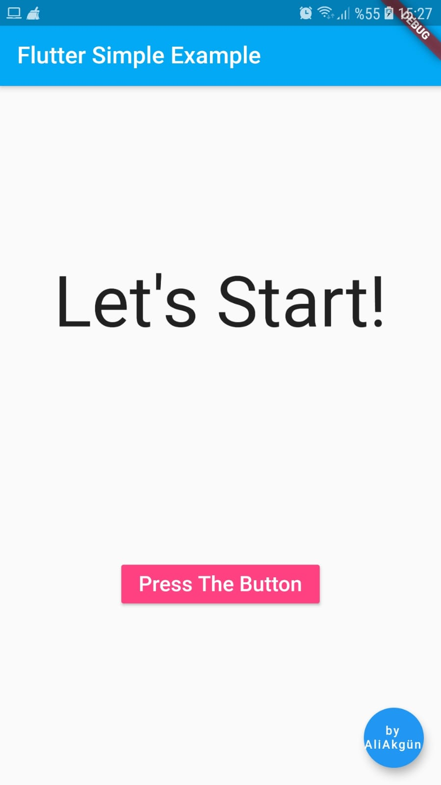

FlutterSimpleExample

--ENGLISH--

A simple example application for beginners in the 'Flutter' language.
On the app's splash screen
It says "Let's Start" and there is a button called "Press The Button".
As we press the button in our application, the words change one by one and at the end
 ('I', 'very', 'love', "learning", "Flutter!") Completes the sentence.
good work.

--TURKISH--

'Flutter' diline başlayanlar için basit bir örnek uygulama.
Uygulamanın açılış ekranında 
"Let's Start" yazısı var ve "Press The Button" adında bir buton var.
Uygulamamızda butona bastıkça kelimeler tek tek değişerek sonda 
 ('I', 'very', 'love', "learning","Flutter!" ) cümlesini tamamlıyor.
iyi çalışmalar.

